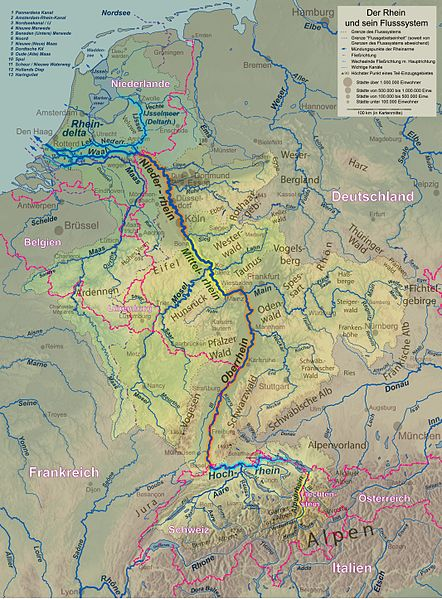
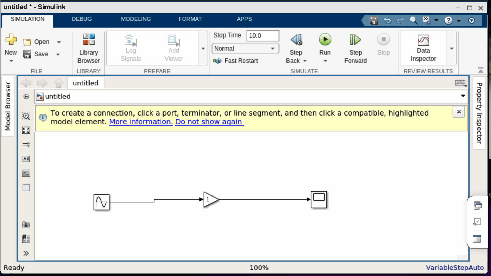

---
jupytext:
  formats: ipynb,md:myst
  text_representation:
    extension: .md
    format_name: myst
    format_version: 0.13
    jupytext_version: 1.13.8
kernelspec:
  display_name: Python 3 (ipykernel)
  language: python
  name: python3
---

# 9.1 Simulink Einführung

MATLAB bietet neben einer Reihe von Toolboxen auch eine Zusatzsoftware an, die
es Ingenieur:innen erleichtert, technische Systeme zu modellieren. Diese
Software heißt Simulink und benötigt MATLAB. Detaillierte Informationen zu
Simulink finden Sie auf der Produktseite von
[MATLAB](https://de.mathworks.com/products/simulink.html). Die Besonderheit von
Simulink ist, dass die Modellierung grafisch mit Blöcken erfolgt.

In diesem Kapitel werden wir uns zunächst mit der Modellierung technischer
Systeme beschäftigen und uns dann die ersten grundlegenden Schritte in Simulink
erarbeiten.

## Lernziele

```{admonition} Lernziele
:class: goals
* Sie können Simulink starten.
* Sie kennen den Unterschied zwischen **Sources** (Quellen) und **Sinks**
  Senken.
* Sie können ein Simulink-Signal mit Hilfe des **Scope**-Blocks visualisieren.
* Sie können ein Signal mit dem **Gain**-Block verstärken.
* Sie können ein Simulink-Modell abspeichern.
```

## Was ist Modellierung?

Das erste Modell, das Sie vermutlich hatten, war eine Modelleisenbahn oder eine
Playmobil-Spiellandschaft – vielleicht haben Sie aber auch aus Legosteinen ein
Auto gebaut? Ein Modell beschreibt die reale Welt in vereinfachter und meist
verkleinerter Form. In den Natur- und Ingenieurwissenschaften sind Modelle die
Grundlage des wissenschaftlichen Arbeitens.

**Modellierung** beschreibt nun den Prozess, ein geeignetes Modell zu finden, um
eine bestimmte Fragestellung zu beantworten. Normalerweise ist kein Modell so
komplex wie die Wirklichkeit. Die Modellierer:innen müssen sich also
entscheiden, welche Details wichtig sind und welche sie weglassen können.
Beispielsweise werden sehr häufig bei Spielzeugfiguren die einzelnen Finger
weggelassen. Aber auch bei Experimenten müssen solche Entscheidungen getroffen
werden. Einmal angenommen, ich möchte wissen, wie lange ich mein Eis in die
Sonne legen kann, bevor es komplett geschmolzen ist. Dann kann ich die
Sonneneinstrahlung oder die Temperatur messen, verschiedene Eissorten nehmen und
die Zeitdauer messen, bis wann das Eis geschmolzen ist. Aber es ist nicht
sinnvoll zusätzlich die Information zu erheben, wie viele Eisbären am Nordpol
gerade einen Fisch gefangen haben.

In den Ingenieurwissenschaften versuchen die Forscher:innen dann aus den Daten
oder den vermuteten Zusammenhängen eine Funktion zu basteln, die hilft die
Zusammenhänge zu verstehen oder Prognosen zu treffen. Wenn diese Modellierung
rein datenbasiert erfolgt, so benutzen wir Methoden der Statistik oder des
maschinellen Lernens. Wenn stattdessen oder zusätzlich prinzipielle
Zusammenhänge einfließen, verwenden wir Gleichungen oder
Differentialgleichungen. Bei Simulink legen wir den Schwerpunkt der Modellierung
auf die Differentialgleichungen.

## Start von Simulink

Da Simulink ein Zusatzprogramm von MATLAB ist, öffnen Sie zuerst MATLAB. Es kann
sein, dass Sie Simulink erst nachinstallieren müssen. Wenn Simulink installiert
ist, finden Sie im Hauptmenü von MATLAB einen Button mit Simulink. Starten Sie
Simulink, legen Sie ein `Blank Model` an und öffnen Sie die Bibliothek mit den
Blockdiagrammen. Die folgende Animationen zeigt Ihnen die notwendigen Schritte.


## Quellen und Senken

Als ein erstes einfaches Beispiel simulieren wir ein System, das durch die
mathematische Funktion $f(x)=2\sin(x)$ beschrieben wird. Damit betrachten wir
zwar noch keine Differentialgleichung, sondern nur eine einfache
Funktionsgleichung, aber können schon die wichtigsten Prinzipien in Simulink
kennenlernen, nämlich die grafische Block-Modellierung. In Simulink wird jede
Eingabe, jeder Verarbeitungsschritt und jede Ausgabe durch einen Block
beschrieben. Diese Blöcke können dann seriell (hintereinander) oder parallel
zusammengebaut werden. Die Idee hinter den zusammengeschalteten Blöcken erinnert
an einen Fluss und seine Nebenflüsse, der letztendlich ins Meer fließt wie
beispielsweise der Rhein. Nur wird in Simulink nicht Wasser transportiert,
sondern Informationen.



Die Quelle an Informationen wird in Simulink **Source**, so wie der englische
Begriff. Die weiteren Informationen wie beispielsweise Anfangswerte oder
Randbedingungen sind ebenfalls Quellen, also Sources und fließen wie die
Nebenflüsse in den Hauptfluss. Der Abfluss, die Senke oder das Spülbecken heißen
auf Englisch **Sink**. Unter den Sink-Blöcken finden Sie also das Ergebnis, die
Ausgabe der Simulation. Wir wollen uns nun das Beispiel

$$f(x)=2\sin(x)$$

in Simulink ansehen. Die Quelle/Source ist die rechte Seite, genauer gesagt die
Sinusfunktion $\sin(x)$. Die Quelle wird noch verstärkt. Verstärker heißt auf
Englisch Gain, also wird noch ein Gain-Block zur Verstärkung dazgeschaltet. Am
Ende mündet alles in eine Visualisierung. Der entsprechende Sink-Block Scope
zeigt das Ergebnis $f(x)$.

Die Blöcke werden in der Bibliothek gesucht. Zur leichteren Navigation dient die
linke Seitenleiste der Library. Dort wird Sink oder Source ausgewählt, um den
Eingabeblock Sinus oder den Ausgabeblock Scope auszuwählen. Der Verstärkerblock
Gain befindet sich bei den häufig genutzten Blöcken. Am einfachsten ist es, die
Blöcke anzuklicken und auf den Arbeitsplatz zu ziehen, wie in dem folgenden
Screencast gezeigt wird.


## Layout und Speichern

Die genaue Anordnung der Blöcke ist nicht wichtig, da durch das Routing
(Verbinden der Blöcke) die Fließrichtung definiert ist. Dennoch empfiehlt es
sich, das Layout übersichtlich zu halten. Der folgende Screencast zeigt, wie die
Blöcke mit der Maus verschoben werden, bis das Verbindungssignal horizontal
ausgerichtet ist. Danach wird gezeigt, wie das erste Projekt unter dem Namen
"firstProject" gespeichert wird.



## Die erste Simulation

Nun können wir die Simulation laufen lassen. Im folgenden Screencast werden zwei
Möglichkeiten gezeigt. Zum einen wird direkt aus dem Hautmenü die Simulation
gestartet. Anschließend wird durch Doppelklick auf den Scope-Block die
Visualisierung eingeblendet. Zum anderen kann auch der Scope-Block zuerst
geöffnet werden und von dort aus die Simulation gestartet werden. Zuletzt wird
moch gezeigt, wie die Verdopplung des Verstärkungsfaktors von 1 auf 2 dazu
führt, dass die Sinusfunktion Funktionswerte zwischen -2 und 2 annimmt.


