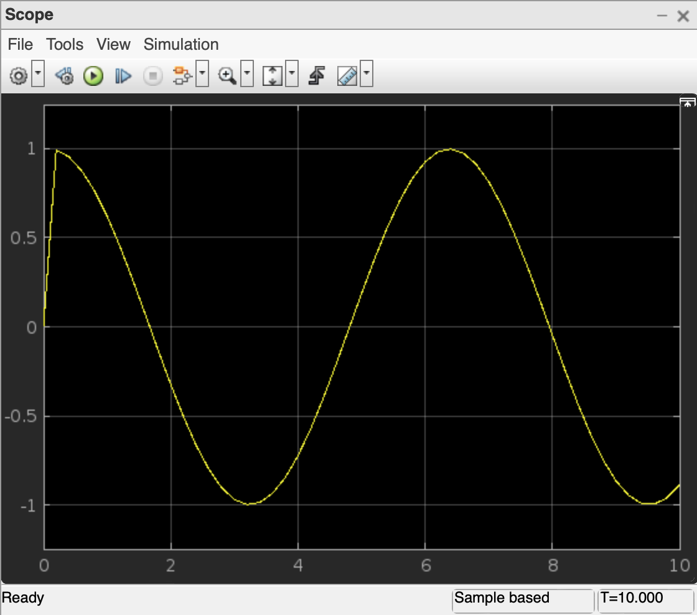

---
jupytext:
  formats: ipynb,md:myst
  text_representation:
    extension: .md
    format_name: myst
    format_version: 0.13
    jupytext_version: 1.13.8
kernelspec:
  display_name: Python 3 (ipykernel)
  language: python
  name: python3
---

# 9.3 Ableitung, Integration und Differentialgleichung mit Simulink

Bei den Modellen treten sehr häufig Differentialgleichungen auf. In diesem
Kapitel betrachten wir die Modellierung einer linearen Differentialgleichung 1.
Ordnung mit Simulink. Davor sehen wir uns noch zwei Beispiele zur Ableitung und
Integration an.

## Lernziele

```{admonition} Lernziele
:class: goals
* Sie können eine Funktion in Simulink ableiten.
* Sie können eine Funktion in Simulink integrieren.
* Sie können eine lineare Differentialgleichung 1. Ordnung mit Simulink-Blöcken
  modellieren.
```

## Ableitung am Beispiel der Sinusfunktion

In dem folgenden Simulink-Modell modellieren wir die 1. Ableitung der
Sinus-Funktion. Dazu wählen wir einen `Sine`-Block als Eingangssignal,
verarbeiten diesen durch den `Derivative`-Block (Derivative ist das englische
Wort für Ableitung) und geben anschließend das Ergebnis über den `Scope`-Block
aus. In Simulink sieht das Modell dann folgendermaßen aus:


Wenn Sie sich nun das Ergebnis der Ableitung durch Doppelklick auf den
Scope-Block ansehen, haben Sie folgende Ansicht:



Auf der einen Seite zeigt das Liniendiagramm die Kosinus-Funktion wie erwartet.
Auf der anderen Seite scheint es gerade am Anfang bei $t=0$ eine Unstimmigkeit
zu geben. Woher kommt das?

MATLAB und Simulink sind numerische Softwaretools. Im Gegensatz zu
Computer-Algebra-Systemen wie WolframAlpha oder GeoGebra können sie *nicht* die
Lösung einer Gleichung oder eine Ableitung symbolisch berechnen. Stattdessen
ermitteln sie Lösung der mathematischen Probleme **numerisch**.
Computer-Algebra-Systeme gehen wie Menschen cor. Das Symbol "hoch 2" wird
manipuliert "hoch 1" (Regel: beim Ableiten einer Potenz wird es eins weniger)
und als Vorfaktor davor geschrieben. Weil Symbole manipuliert werden, heißt
diese Lösungsmethode **symbolisch**. Stattdessen erstellt MATLAB eine
Wertetabelle der Funktion, die abgeleitet werden soll. Danach geht MATLAB diese
Tabelle Stück für Stück durch und bildet zwischen dem ersten und dem zweiten
Punkt das Steigungsdreieck, dann zwischen dem zweiten und dem dritten Punkt und
immer so weiter. Danach zeichnet MATLAB bzw. Simulink die Liste der Steigungen
der Steigungsdreiecke und hat damit eine Näherung der 1. Ableitung gefunden.

## Integration am Beispiel der Wurzelfunktion

Als nächstes Beispiel wollen wir die Funktion

$$u(t) = \sqrt{t}$$

integrieren. Das Ergebnis ist eigentlich $U(t) = \frac{2}{3} t^{3/2} + C$, aber
standardmäßig wird die Integrationskonstante auf Null gesetzt, also $C = 0$.

Um das Eingangssignal $t$ zu erzeugen, verwenden wir wiederum den `Ramp`-Block.
Danach stecken wir $t$ in die Wurzelfunktion. Die Wurzelfunktion gehört zu den
`Math Operations`, der entsprechende Block heißt `sqrt`-Block. Verbinden wir
beide Blöcke, so erzeugen wir insgesamt $\sqrt{t}$.

Nun integrieren wir das Eingangssignal mit dem `Integrator`-Block, der sich in
der Bibliothek `Continuos` befindet. Das Ergebnis visualisieren wir mit einem
`Scope`-Block.

Das fertige Blockdiagramm zeigt der folgende Screenshot.


## Lineare Differentialgleichungen 1. Ordnung

Nun schauen wir uns noch am Beispiel der folgenden linearen
Differentialgleichung 1. Ordnung

$$\dot{x}(t)=-2x+1, \quad x(0)=0,$$

an, wie in Simulink die numerische Lösung der Differentialgleichung konstruiert
wird.

Dazu werden nacheinander die Blöcke

* Sources $\rightarrow$ Constant
* Math Operations $\rightarrow$ Add
* Continuous $\rightarrow$ Integrator
* Commonly Used Blocks $\rightarrow$ Gain
* Sinks $\rightarrow$ Scope

in den Arbeitsbereich gezogen und wie in den folgenden Screenshots rot markiert
verbunden. Zuletzt ermöglicht der Start der Simulation eine Visualisierung der
numerischen Lösung über die Scope-Ausgabe.

Die folgende Sequenz an Screenshots zeigt nacheinander die notwendigen Schritte,
um die Differentialgleichung

$$\dot{x}(t)=-2x+1, \quad x(0)=0,$$

zu modellieren.

```{code-cell} ipython3
:tags: [remove-input]
from IPython.display import HTML
HTML('../assets/chapter12/simulink_ode.html')
```

## Zusammenfassung

Dieser kurze Einstieg in Simulink kann nur der Anfang sein. Wenn Sie Simulink
vertiefen wollen, bietet Mathworks zahlreiche (englischsprachige)
[Tutorials](https://de.mathworks.com/products/simulink.html) an.
